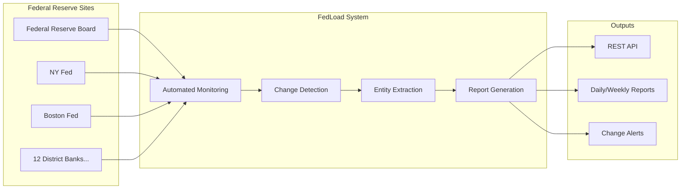

# FedLoad

A lightweight system to monitor US Federal Reserve websites for content changes, providing automated tracking, entity recognition, and report generation for Federal Reserve communications.

## 🎯 Overview

FedLoad monitors all 12 Federal Reserve district banks plus key FED/FRB `.gov` sites, detecting content changes and generating comprehensive reports. The system is designed for researchers, analysts, and organizations tracking Federal Reserve communications and policy changes.

### How FedLoad Works


### Key Features
- **Automated Monitoring**: Tracks all 12 district banks + key Federal Reserve websites
- **Change Detection**: Advanced hash-based content change detection with configurable algorithms
- **Entity Recognition**: Optional NLP-powered extraction of people, organizations, and publications
- **Report Generation**: Daily HTML reports ready for web/newsletter publication
- **API Interface**: RESTful API with interactive documentation
- **Performance Optimized**: Fast MD5 hashing with initial byte checking for quick detection
- **Security Focused**: Optional URL filtering, content size limits, and comprehensive validation

## 🚀 Quick Start

### Installation

#### Linux/Mac (Bash)
```bash
git clone <this-repo>
cd fedload
python3 -m venv .venv
source .venv/bin/activate
pip install -r requirements.txt
python -m spacy download en_core_web_sm
```

#### Windows (PowerShell)
```powershell
git clone <this-repo>
cd fedload
python -m venv .venv
.venv\Scripts\Activate.ps1
pip install -r requirements.txt
python -m spacy download en_core_web_sm
```

### Basic Usage

#### Start API Server

**Linux/Mac (Bash)**
```bash
uvicorn main:app --reload
```

**Windows (PowerShell)**
```powershell
uvicorn main:app --reload
```

Access interactive documentation at: http://127.0.0.1:8000/docs

#### Start Automated Monitoring

**Linux/Mac (Bash)**
```bash
python scheduler.py
```

**Windows (PowerShell)**
```powershell
python scheduler.py
```

The scheduler will check sites every 30 minutes (configurable) and generate daily reports.

## 📊 API Endpoints

| Endpoint | Method | Description |
|----------|--------|-------------|
| `/` | GET | System status |
| `/docs` | GET | Interactive API documentation |
| `/check` | GET | Check specific FED website for changes |
| `/entities` | GET | Get all tracked entities |
| `/publications` | GET | Get tracked FED publications |
| `/config` | GET | View current configuration |

**Example**: Check Federal Reserve website

**Linux/Mac (Bash)**
```bash
curl "http://127.0.0.1:8000/check?url=https://www.federalreserve.gov/"
```

**Windows (PowerShell)**
```powershell
Invoke-RestMethod -Uri "http://127.0.0.1:8000/check?url=https://www.federalreserve.gov/"
```

## 📁 Data Files

The system generates and maintains several key files:

- **`config.json`** - System configuration and settings
- **`tracked_sites.json`** - List of monitored URLs
- **`change_log.json`** - History of detected changes
- **`entity_store.json`** - Accumulated named entities
- **`daily_report.html`** - Web-ready change report
- **`fed_entities.json`** - Knowledge base of FED officials and publications

## ⚙️ Configuration

Configure the system through `config.json`:

### Essential Settings

```json
{
  "scheduling": {
    "check_frequency_minutes": 30,
    "report_generation": {
      "daily_report": {
        "enabled": true,
        "time": "00:00"
      }
    }
  },
  "entity_recognition": {
    "enabled": false
  },
  "monitoring": {
    "content_hash_algorithm": "md5",
    "max_content_size_mb": 50,
    "timeout_seconds": 10
  }
}
```

### Key Configuration Options

#### Entity Recognition
- **`enabled: false`** (default) - Content monitoring only, faster performance
- **`enabled: true`** - Full NLP processing with spaCy entity extraction

#### Monitoring Performance
- **`content_hash_algorithm`** - "md5" (fast) or "sha256" (secure)
- **`hash_check_initial_bytes`** - Quick change detection (default: 512 bytes)
- **`max_content_size_mb`** - Content size protection (default: 50MB)

#### URL Security
- **`require_gov_tld`** - Restrict to .gov domains only (default: false)
- **`url_filtering`** - Advanced whitelist/blacklist controls

## 📈 Reports and Output

### Daily Reports
Automatically generated HTML reports include:
- Summary of all monitored sites
- Detected changes with timestamps
- Extracted entities (if NER enabled)
- Change statistics and trends

### Entity Tracking
When enabled, the system tracks:
- **People**: Federal Reserve officials, board members
- **Organizations**: FOMC, district banks, committees
- **Publications**: Beige Book, FOMC Minutes, policy statements
- **Events**: FOMC meetings, policy announcements

## 🔧 System Architecture

### Core Components
- **`main.py`** - FastAPI server with REST endpoints
- **`scheduler.py`** - Automated monitoring and report generation
- **`fetcher.py`** - Web content fetching and text extraction
- **`hasher.py`** - Content hashing and change detection
- **`config_manager.py`** - Configuration management
- **`fed_entity_recognizer.py`** - Federal Reserve-specific entity recognition

### Data Flow
1. **Scheduler** checks sites at configured intervals
2. **Fetcher** retrieves and extracts content using multiple parsers
3. **Hasher** computes content hashes for change detection
4. **Entity Recognizer** extracts relevant entities (if enabled)
5. **Report Generator** creates HTML reports
6. **API Server** provides real-time access to data

## 🛡️ Security Features

- **Content Size Limits**: Protection against excessive content
- **URL Validation**: Optional .gov TLD requirements and filtering
- **Timeout Protection**: Configurable request timeouts
- **Input Sanitization**: Comprehensive validation of all inputs
- **Error Isolation**: Robust error handling prevents system crashes

## 📋 System Requirements

- **Python**: 3.12+ recommended
- **Memory**: 512MB minimum (2GB+ recommended with NER enabled)
- **Storage**: 1GB for logs and data files
- **Network**: Reliable internet connection for Federal Reserve sites

## 🔄 Operational Modes

### Production Mode
- NER disabled for optimal performance
- MD5 hashing for fast change detection
- Automated daily reports
- Comprehensive error logging

### Research Mode
- NER enabled for detailed entity extraction
- Enhanced entity enrichment
- Custom entity databases
- Detailed change analysis

## 📚 Documentation

- **DEVELOP.md** - Development setup, debugging, and troubleshooting
- **TODO.md** - Development roadmap and planned enhancements
- **FIXES_SUMMARY.md** - Recent improvements and bug fixes
- **DOCKER.md** - Container deployment guide
- **GITHUB_ACTIONS.md** - CI/CD pipeline documentation

## 🆘 Support

### Quick Troubleshooting
1. **API not responding**: Check if uvicorn server is running
2. **No changes detected**: Verify sites are accessible and configuration is correct
3. **Entity extraction issues**: Ensure spaCy model is installed and NER is enabled
4. **Report generation fails**: Check file permissions and disk space

### Getting Help
- Check **DEVELOP.md** for detailed troubleshooting
- Review logs in the `logs/` directory
- Verify configuration with `/config` API endpoint
- Run test suite: `python -m pytest tests/ -v`

## 📊 Project Status

**Current Version**: 2.0 (Production Ready)

### ✅ Completed Features
- Reliable content change detection
- Optional entity recognition system
- Comprehensive error handling
- Performance optimizations
- Security enhancements
- Automated testing suite
- Docker containerization
- CI/CD pipeline

### 🔄 Active Development
- Modular architecture refactoring
- Enhanced security features
- Advanced monitoring capabilities
- Extended entity recognition

## 📄 License

This project is designed for monitoring public Federal Reserve communications and operates within fair use guidelines for research and analysis purposes.

---

**For detailed development instructions, see DEVELOP.md**  
**For planned enhancements, see TODO.md**